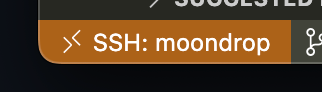
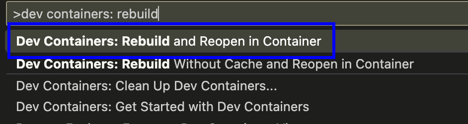
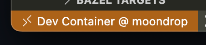
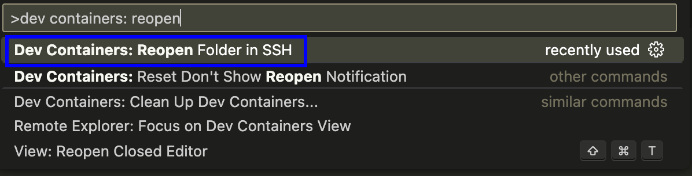
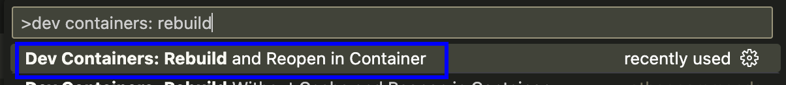

# Overview

This project serves as a quick jumpstart baseline to set up your own C++ project with a few out-of-the-box infrastructure such as:
1. Docker - Baseline Docker compose file
2. Bazel - Build system
3. gRPC - Communication protocol including a library and IDL
4. Example C++ projects

# Getting Started

This project is intended for Linux environments and is specifically tested against Ubuntu 24.04 LTS. Older Ubuntu versions such as 22.04 LTS and 20.04 LTS should also work. Additionally, this project is geared towards environments with a x86-64 CPU architecture and using only a single user.

This project comes packaged with a Docker image intended to act as your development environment. All Docker related files resides in the `.devcontainer` directory. To development in this repo, you will need:
- [VSCode](https://code.visualstudio.com/)
- [VSCode Extension: Dev Containers](https://marketplace.visualstudio.com/items?itemName=ms-vscode-remote.remote-containers) (Install using VSCode GUI)
- [Docker Engine](https://docs.docker.com/engine/) 

The development Docker container runs indefinitely in the background and serves as your development environment ready to be used at any time. It contains development software tools such as Bazel, native toolchain, Python, etc.

## Set Up Development Environment

The first thing you will need to do is set up your development environment.

1. Run the setup script. This setup script should ensure [Docker Engine](https://docs.docker.com/engine/) is installed.

```bash
./setup.sh
```

## Learn To Switch Between Local/SSH Mode (personal) / Container Mode (standardized)

As a background, I usually operate remotely where my source code and personal shell customizations all reside on a remote Linux server. In this case, my VSCode would be in `SSH Mode`. Similarly, `Local Mode` is when the source code and shell customizations all reside locally. This repo is intended to operate in `Container Mode` which is a standardized development environment (shell customizations, command line utilities, etc.) controlled by the contents of the `.devcontainer` directory and the Docker image residing in it.

1. Assuming this is your first time using this repo, observe that you are in `Local Mode` or `SSH Mode`. In this example, I'm in SSH mode.



2. Using the [Command Palette](https://docs.github.com/en/codespaces/reference/using-the-vs-code-command-palette-in-codespaces#accessing-the-vs-code-command-palette), rebuild and reopen to `Container Mode`. This step may take a couple of minutes as the Docker image builds in the background.



3. Observe that you are in `Container Mode`. In this mode, you can [Open Terminal](https://code.visualstudio.com/docs/terminal/basics) which will open a shell session inside the development Docker container.



Note, you can reopen back to `Local Mode` or `SSH Mode` at any time using the [Command Palette](https://docs.github.com/en/codespaces/reference/using-the-vs-code-command-palette-in-codespaces#accessing-the-vs-code-command-palette)



## Build Your First Project

After setting up your development environment, start off by building your first project.

1. Ensure you are in `Container Mode`

2. Build the example hello world C++ program

```bash
bazel build projects/examples/hello_world
```

3. Run the hello world program

```bash
bazel-bin/projects/examples/hello_world/hello_world
# Hello world!
```

# Usage

To use this project, **YOU MUST USE THE DEVELOPMENT CONTAINER**. Do not skip the [Getting Started](#getting-started) workflow.

## Build

To build a C++ project, in `Container Mode`, build any Bazel project using the `bazel` command.

```bash
# For example, build every project
bazel build projects/...
```

**Not Recommended:** Alternatively, you can build while in `Local/SSH Mode`, but you must use the development container.

```bash
docker exec -it devcontainer bazel build projects/...
```

# Troubleshooting

### Docker container `devcontainer` already exists

Switching to `Container Mode` may fail because the Docker image build may fail due to the container `devcontainer` already exists. In this case, simply delete the container, rebuild the image, and restart the container.

1. While in `Local/SSH Mode`, stop and delete the container

```bash
docker container rm -f devcontainer
```

2. Reattempt to switch to `Container Mode`

# For Maintainers

This section is intended for maintainers only.

## Docker

To edit and test the development Docker container:

1. Edit Docker stuff inside `.devcontainer`
2. In VSCode command palette, run:



3. Test Docker changes either in `Container Mode` OR manually using the `docker exec` command.

```bash
# Alternatively, manually open a shell session in the development container
docker exec -it devcontainer bash
```
